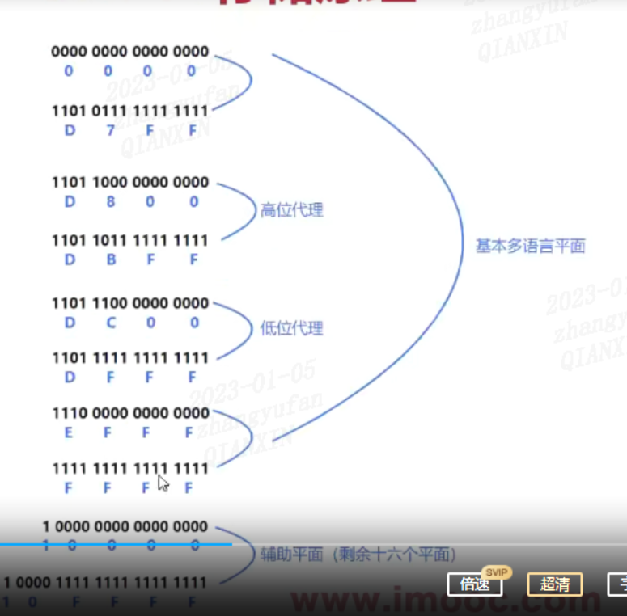

# 各种码

## 字符编码

### 编码表示方式

```js
'a';
`a`;
('a');
('\141');
('\x61');
('\u0061');
('\u{0061}');
```

### ASCII 码

- ASCII 码占用一个字节，一个字节为 8bit 位
- ASCII 码第一位始终是 0

### Unicode

- 为每个字符都配备了唯一的编号
- 是一个字符集，兼容 ASCII 码
- UTF-8 和 UTF-16，均是 Unicode 字符编码的一种实现
- localStorage 存储的字符是基于 UTF-16 编码的
- cookie 存储的字符是基于 UTF-8 编码的

### 码点

- 某个字符规定对应的数值，称之为码点
- 通过字符串的实例方法 codePointAt 获取码点
- 通过字符串的静态方法 fromCodePoint 获取字符

总结：
格式|示例|码点范围|注意
|-|-|-|-|
\8 进制|'\141'|0-255|模板字符串不可直接使用
\x 两位 16 进制||0-255|必须两位
\u 四位 16 进制|0-65535|必须四位
\u{16 进制}||0-0x10FFF|码点大于 0x10FFF，length 为 2，下标访问值是高低位的值

## UTF-16

### 码点与码元

- JS 内部，字符以 UTF-16 来存储
- 对于 UTF-16 来说， 一个码元是 16bit（两个字节）
- 对于 UTF-32 来说， 一个码元是 32bit（四个字节）

```js
// length对应返回的是几个码元
const str = 'A'; // Unicode编码是\u0041\ 为1个码元
const str2 = '糺'; // Unicode编码是\ud848\udc98 为2个码元
console.log(str.length); // 1
console.log(str2.length); // 2
```

#### charCodeAt 与 codePointAt

- charCodeAt：根据码元匹配
- codePointAt：根据码点匹配

### ES6 字符串遍历

- 由于实现了 Symbol.iterator 迭代器，所以可以用 for of/扩展运算符 对字符串进行遍历

### UTF-16 存储原理

- 第 0 平面，包含了大量常用字符和符号，同时还包含了代理区（高码点代理区和低码点代理区）
- 高代理区：U+D800 ~ U+DBFF
- 低代理区：U+DC00 ~ U+DFFF
- 

### 缺点

- 存在空间上的浪费，最少可以用一个字节的，它的最低单元采用两个字节
- 目前 Unicode5.0 收录的字符已经超过 UTF-16 所能表达的最大范围

## Base64

### 在前端中的应用

#### canvas 图片生成

- 原理：canvas 的 to'Data'URL 可以把 canvas 画布内容转换为 base64 编码格式包含图片展示的 dataURL
- ```js
  canvasEL.toDataURI();
  ```

#### 文件获取

- FileReader 的 readAsDataURL 可以把上传的文件转为 base64 格式的 dataURI，常见场景是用户头像的裁剪和上传
- ```js
  function readAsDataURL() {
    const fileEl = document.getElementById('inputFile');
    return new Promise((resolve, reject) => {
      const fd = new FileReader();
      fd.readAsDataURL(fileEl.files[0]);
      fd.onload = function () {
        resolve(fd.result);
      };
      fd.onerror = reject;
    });
  }
  ```

#### JWT

- 定义：jwt 是由 header，payload，signature 三个部分组成，前后两个解码后，都可以明文看见

#### 移动端网站优化

- ```html
  <link rel='icon' href='data;,'></link>
  <link rel='icon' href='data:;base64,='></link>
  ```

#### 小图片

- ```html
  

  .bg{ background:url(data:img/png;base64,iVdsiadjaoidujaisud....) }
  ```

#### 简单的数据加密

- 方式：utf8_to_base64('dsaidao'+'$%@^$@...')

#### SourceMap

- mappings 字段用的就是 base64 编码格式的内容
- ```js
  {
  version:3,
  file:'out.js',
  sourceRoot:"",
  sources:['foo.js','bar.js'],
  names:['src','maps','are','fun'],
  mappings:'AAgBC,SAAQ,CAAEA'
  }
  ```

#### 其他应用场景

- X.509 公钥证书，github SSH key，mht 文件，邮件附件等等，都有 base64 的影子

### base64 编码起源

- 作用：能在各个网关之间无错的传输，而不在于安全性
- 64 含义：A-Z + a-z + 0-9 + '+' + '/'

### 优点

- 可以将二进制数据（比如图片）转化为可打印字符，方便数据传输
- 对数据进行简单的加密
- 如果是在 html 或者 css 处理图片，可以减少 http 请求

### 缺点

- 内容编码后体积变大，至少 1/3，因为三字节会变成四字节，只有一个字节的时候，也至少会变成三字节
- 编码解码需要额外工作量

### UTF-8 转 base64 编码

- 基本流程：char => 码点 => utf-8 编码 => base64 编码
