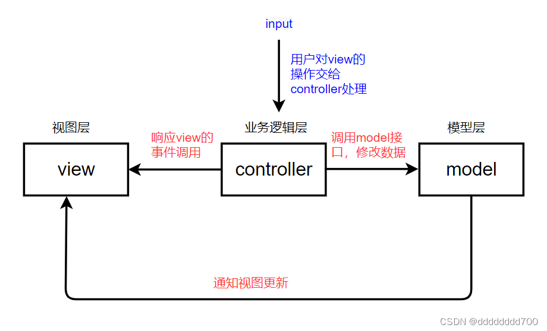
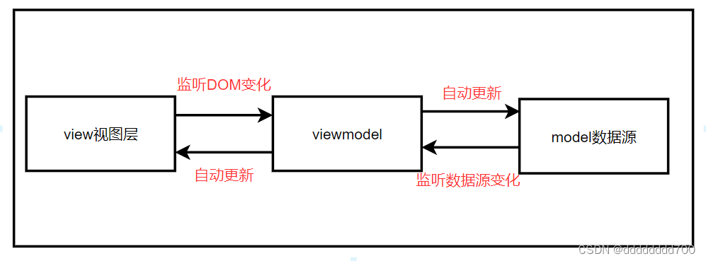

# 常见的架构模式

## MVC 和 MVVM 模式

### MCV

- 定义：
  - Model：数据模型
  - Contoller：控制器
  - View：视图
- 原理：用户交互事件通过 controller 来控制 Model 和 View；当 Model 修改时，直接通知 View 更新
  - 

### MVVM

- 定义：
  - Model：数据模型
  - Contoller：控制器
  - View：视图
- 原理：用户教书事件通过 view 通知 viewModel，进而修改 model 数据模型；model 变更，通知 viewModel，进而修改 view
- 好处：实现了数据双向绑定
- 与 MVC 区别：抽离了 Controller 的业务逻辑
  

## ESLint 架构

- 解析器：根据自己的规则和语法支持，将 js 代码转换成 ast
- 规则：自定义代码检查规则的配置项，包括错误检查、代码风格等等
- 规则集：是一组规则的集合，用于指定在特定上下文中要应用的规则。ESLint 使用配置文件（如.eslintrc.js 或 package.json）来定义规则集
- 插件：扩展 ESLint 功能的方式。ESLint 的插件是独立的 npm 包，提供了额外的规则、解析器、预设或其他功能。
- 运行时：运行时是 ESLint 的执行环境，它负责加载解析器、规则和插件，并应用它们来检查代码。运行时会根据配置文件中的规则集和插件配置来初始化检查过程，并生成代码检查报告。
- CLI 工具：一个命令行界面工具，用于在终端中执行代码检查任务

## Babel 基本架构

1. 词法分析：将源代码进行词法分析，将其分解为一系列的词法单元（Tokens）
2. 语法分析：将词法单元组织成 AST，表示源代码的结构和语法。语法分析是将词法单元转换为 AST 的过程
3. 转换：允许开发人员在 AST 级别对代码进行修改、添加或删除节点。通过遍历和操作 AST，插件可以实现各种转换操作，如语法转换、特性转换、代码优化等
4. 生成：在转换完成后，Babel 将修改后的 AST 重新生成为目标代码，即转换后的 JavaScript 代码。生成过程将 AST 转换为字符串形式的代码，以便输出或进一步处理

## webpack 插件基本架构

1. 插件：Webpack 的插件是一个 JavaScript 对象，它可以扩展 Webpack 的功能，并在构建过程中执行特定的任务。
2. 生命周期：Webpack 的构建过程由一系列的生命周期钩子组成，插件可以在这些钩子上注册函数，以在特定的构建阶段执行任务，如：beforeRun，run，beforeCompile，compile，emit 等等
3. 插件实例化：需要实例化插件对象，并将其作为配置的一部分传递给 Webpack，需要传递一些参数配置实现个性化处理
4. 插件功能：可以根据项目需求进行定制功能。如：文件的压缩、代码的拆分、资源的优化、生成额外的文件、注入全局变量等，通过在适当的生命周期钩子上执行任务，插件可以与 Webpack 的构建流程无缝集成，并对输出结果进行修改或增强
5. 插件加载：插件可以通过 npm 包的形式进行安装，并在配置文件中引入，Webpack 将根据配置文件中的插件配置，自动加载和执行插件
