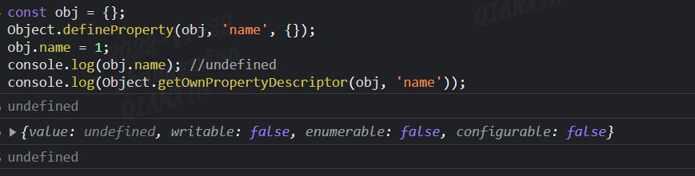

# 对象属性

## 常规属性

- 键为字符串：会按照创建顺序进行排序

## 排序属性

- 键作为数字：会按照数字进行排序

## 设计的好处

- 提升属性访问速度
- 两种线性数据保存

## 内置属性

- 定义：被保存到对象自身的常规属性

## 隐藏类

- 定义：对对象的一些属性描述。
- 作用：时间上，提升访问速度；空间上，节约内存。

## 对象的 delete 操作性能差

## 属性类别

- 静态属性，如 Object.assign
- 原型属性，如 Object.prototype.toString
- 实例属性，如构造函数中的 this.name='name'

## 属性描述符

- configurable:可配置
- enunmberable:可枚举
- value:值
- writable:可被改写
- get：访问器函数
- set：访问器函数
- 数据属性：value + writable + configurable + enunmberable
- 访问器属性：get + set + configurable + enunmberable
- 注意：
  

## Object.defineProperty 缺点

- 无法监听数组变化
- 只能劫持对象属性，需要遍历对象属性；属性是对象，还要进行递归。

## 对象的可拓展

- Object.preventExtensions：对象变得不能拓展，不能再添加新属性。
- Object.isExtensible：对象的是否可拓展

## 对象的封闭

- Object.seal：组织添加新的属性+标记属性不可配置
- Object.isSeal：检查一个对象是否被封闭。

## 对象的冻结

- Object.freeze：不添加新属性+不可配置+不能修改值
- Object.isFrozen：检查一个对象是否被冻结

# 访问原型的方法

## prototype

- prototype 是一个对象

- 通过原型链查找属性方法比较耗时

## \_ _ proto _ \_

- 构造函数的原型都有这个属性，除 null 以外

- Function，class 的实例有 prototype 以及** proto **属性

- 普通函数，祖上三代必为 null

## instanceof

- 检测构造函数的 prototype 属性是否出现在某个实例对象上
- 手写 instanceof
  ```js
  function myInstanceof(left, right) {
    let proto = left.__proto__;
    let prototype = right.prototype;
    while (proto) {
      if (proto === prototype) {
        return true;
      }
      proto = proto.__proto__;
    }
    return false;
  }
  ```
- 注意：
  - Object instanceof Function // true
  - Function instanceof Object // true

## getPrototypeOf

- 作用：返回对象的原型
- 用法：Object.getPrototypeOf/Reflect.getPrototypeOf
- 内部先将参数用 toObject 转换，注意 null 和 undefined 没有原型

## setPrototypeOf

- 作用：指定对象的原型
- 用法：Object.setPrototypeOf/Reflect.setPrototypeOf
- 原型尽头是 null

## isPrototypeOf

- 作用：一个对象是否存在另一个对象的原型链上
- 用法：Object.prototypeOf.isPrototypeOf()

## Object.create

- 作用：创建纯净对象

# 对象遍历

## 属性类型

- 普通属性
- 不可枚举属性
- 原型属性
- symbol 属性
- 静态属性

## 遍历方式

| 方法名                       | 普通属性 | 不可枚举属性 | symbol 属性 | 原型属性 |
| ---------------------------- | -------- | ------------ | ----------- | -------- |
| for in                       | √        | ×            | ×           | √        |
| Object.keys                  | √        | ×            | ×           | ×        |
| Object.getOwnPropertyNames   | √        | √            | ×           | ×        |
| Object.getOwnPropertySymbols | ×        | √            | √           | ×        |
| Relect.ownKeys               | √        | √            | √           | ×        |
