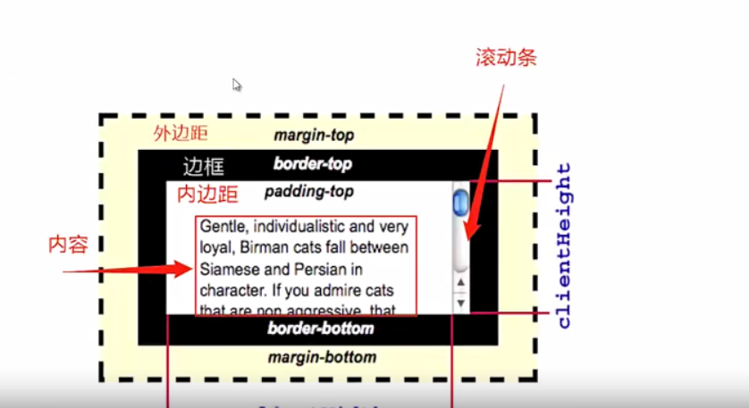

# 操作 dom/node 节点

## 增加与查找总结

| 方法名                 | 单个元素 | 节点列表 | 元素集合 | 元素也拥有 | 实时更新 |
| ---------------------- | -------- | -------- | -------- | ---------- | -------- |
| getElementById         | √        |
| querySelector          | √        |          |          | √          |
| getElementsByClassName |          |          | √        | √          | √        |
| getElementsByName      |          | √        |          |            | √        |
| getElementsByTagName   |          |          | √        | √          | √        |
| querySelectorAll       |          | √        |          | √          | √        |

## 查询伪元素

- 不能查询为元素
- 但是能获取到样式：window.getComputedStyle

## 元素集合与 Nodelist 遍历

- for/while 遍历
- NodeList.prototype.forEach
- 也可以转为数组进行遍历：Array.from，Array.prototypr.slice 等等

## 某节点/元素所有子节点/元素

- children/childNodes
- Nodelterator 或者 TreeWalker
- 区别：
  - TreeWalker 是 nodeLterator 的更高版本
  - 额外有：parentNode，firstChild，lastChild，nextSibling

## node 对象方法

- appendChild
- insertBefore
- replaceChild
- textContent

## Element 对象方法

- after&before
- append&prepend
- insertAdjacent 系列
- replaceChildren&replaceWith
- insertHTML&innerText

## 节点复制

- Node.cloneNode
  - 节点克隆
  - 分为浅克隆与深克隆
- Document.importNode
- Document.adoptNode
- Element.innerHTML

## 批量删除

- outerHTML&innerHTML
- 循环删除

## 创建节点

- 对象模型直接 new
- document.create 系列

## 删除节点

- Node.removeNode
- Element.remove
- outerHTML&innerHTML
- Document.adoptNode

## 内存泄露

```js
// dom元素或者时间监听操作手动清空
var root = document.createElement('div');
var div = document.createElement('div');
div.appendChild(new Text('文本'));
root.appendChild(div);
// 经过一系列操作
root.removeChild(div); // 挂载到window上，未清除

// 检查div是否回收
const wkRef = new WeakRef(div);
console.log(wkRef.deref()); // <div>文本</div> 存在
div = null; // 手动清除
setInterval(() => {
  console.log(wkRef.deref());
}, 1000);
// 闭包：立即执行函数来清除
```

## 相似的知识点

### 文本

- HTML.element.innerText
- Node.textContent
  </br>| Node.textContent|HTMLElement.innerText
  -|-|-
  style,script 标签，隐藏的内容（diplay:none）|包含|不包含
  br 标签|无效|有效
  \t、\n 等转义字符|有效|不包含
  连续空格|有效|合并为一个

### 节点值

- value：是特定的 HTMLElement 元素属性
- Node.nodeValue：是节点的值

### 宽高

- element.clientWidth/clientHeight
  - 元素的宽高：width + padding（不包含 border，margin，滚动条）
- HTMLElement.offsetWidth/offsetHeight
  - 元素局部宽高：width + padding + border + 滚动条（不包含 margin）
- Element.scollWidth/scrollHeight
  - 元素内容宽高：width + padding + 溢出内容（包括由于元素内容 overflow 溢出屏幕的不可见内容）
    

### 位置关系

- Node.contains
  - 定义：返回值为布尔值，传入节点是否为该节点的后代节点
- Node.compareDocumentPosition
  - 定义：返回值是数字，比较当前节点与任意文档中的另一个节点的位置关系
- Element.getBoundingClientRect
  - 定义：返回元素大小及其相对可视化窗口（导航栏下面的窗口）（视口）的位置
- Element.getClientRects
  - 定义：返回盒子编剧矩形集合

### 加载

- window.onload（后）
  - 在文档加载完成后会触发 onload 事件。此时，在文档中的所有对象在 DOM 中，所有图片，脚本，链接以及子框架完成了装载。
- DOMContentLoaded（先）
  - 在初始化的 HTML 文档被完全加载和解析完成之后，DOMContentLoaded 事件被触发，而无需等待样式表，图像和子框架（iframe）的完全加载。

### 子节点集合

- Node.childNodes
  - 节点的子节点集合，包括元素节点，文本节点...
- Element.children
  - 返回的只是节点的元素节点集合，即 nodeType 为 1 的节点

### 添加节点

- Node.appendChild
  - 将一个子节点附加到指定父节点的子节点列表的末尾
- Element.append
  - 在父节点的最后一个子节点插入一组 node 对象或者 DOMString 对象

### 克隆和导入

- Document.adoptNode
  - 从外部文档拷贝一份到当前文档
- Document.importNode
  - 从外部文档获取一个节点并删除外部文档节点
- Node.cloneNode
  - 从本文档进行复制，分为浅克隆与深克隆

## web component

### 使用步骤

- 编写 Web Component 组件
- 注册 Web Component 组件
- 使用

```js
<my-test></my-test> // 使用
<script>
    // 自定义
    class myTest extends HTMLElement{
        constructor(){
            super()
            this.append('文本')
        }
    }
    window.customElements.define("my-test",myTest) // 注册
</script>
```

### 优点

- W3C web 标准
- 兼容性相对较好
- 天然模块化，自带样式隔离
- 开箱即用

## 适用场景

- 组件库
- 微前端

## custom elements

- 自主定制元素
- 自定义内置元素
- 生命周期
- name 必须包含一个：-

## HTML templates

- 标签 template
  - 节点
  - 样式
- slot：需要配合 shadowDoms
- 样式隔离
  - shadow DOM

```js
// template
<template id="tpl-product-item">
  <div class="name"></div>
  <div class="price"></div>
</template>
<product-item name="产品" price="90"></product-item>
<script>
class ProductItem extends HTMLElement {
  constructor() {
    super();
  }
  connectedCallback() {
    const content = document
      .getElementById('tpl-product-item')
      .connect.cloneNode(true);
    this.append(content);
    this.querySelector('.name').innerText = this.getAttribute('name');
    this.querySelector('.price').innerText = this.getAttribute('price');
  }
}
window.customElements.define('product-item', ProductItem);
</script>
```

```js
// slot
<template id='tpl-test'>
    <style type='text/css'>
.title{color:red}

    </style>
<div class='title'>标题</div>
<slot name='slot-des'>默认内容</slot>
</template>
<test-item>
<div slot="slot-des">不是默认内容</div>
</test-item>
<script>
class TestItem extends HTMLElement {
  constructor() {
    super();
  }
  connectedCallback() {
    const content = document.getElementById('tpl-test').content.cloneDeep(true);
    // this.append(content); // 不生效
    const shadow = this.attachShadow({ mode: 'open' });
    shadow.append(content);
  }
}
window.customElements.define('test-item', TestItem);

</script>
```

## 生命周期

- connectedCallback：插入文档时
- disconnectedCallback：从文档删除时
- adoptedCallback：被移入新文档时
- attributeChangedCallback：属性变化时

- 场景：
  - 插入文档时：
    1. attributeChangedCallback
    2. connectedCallback
  - 属性更新时：
    1.attributeChangedCallback
  - 删除时：
    1.disconnectedCallback
  - 随文档移动时：
    1.disconnectedCallback
    2.adoptedCallback
    3.connectedCallback

## shadow DOM

- 影子 DOM，其内部样式不共享
- 影子 DOM，其内部元素不可以直接被访问到
- 参数：mode（'open'/'closed'）
  - open：shadow root 元素可以从 js 外部访问根节点
  - closed：拒绝从 js 外部访问关闭的 shadow root 节点
