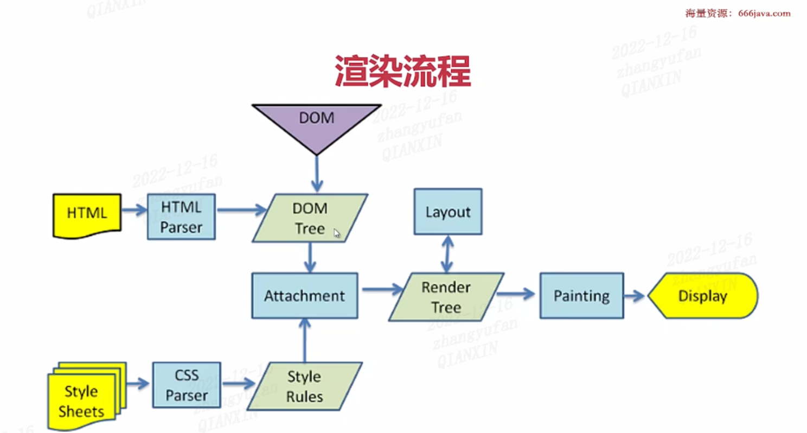
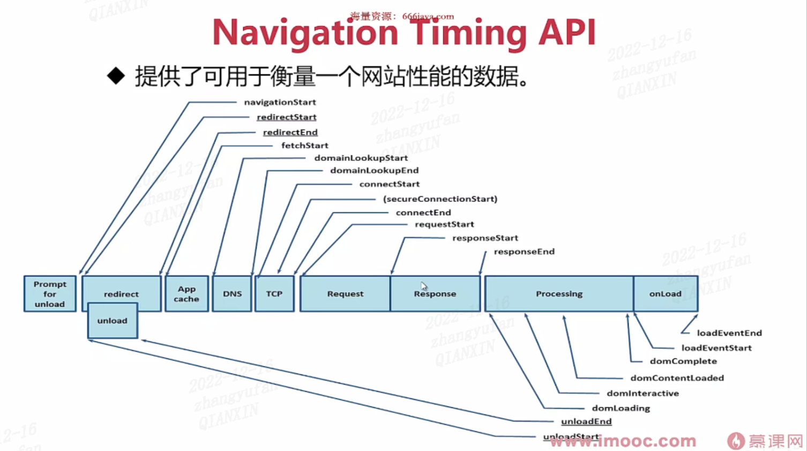

# http

## 文件上传以及取消请求

### 请求取消

#### XMLHttpRequest.abort()

#### fetch 的 AbortController 的 abort()

### 文件上传（单个）

#### 文件上传步骤

1. input 标签选择文件/拖拽文件获取文件/复制到剪切板获取文件
2. File Api 获取文件信息
3. XMLHttpRequest 上传/Fetch 上传
4. 上传数据：FormData/Blob 等，服务器端：formData 使用 multipart/form-data

#### 上传单个文件-客户端

```js
// type类型为file，用户选择文件
// accept属性，规定选择文件的类型
<input id="uploadFile" type="file" accept="image/*"></input>
```

- accept 类型
  - 文件拓展名（.jpg，.png，.doc）
  - 一个有效的 MIME 类型文件，但没有拓展名（text/html，video/mp4）
  - audio/\* 表示音频文件
  - video/\* 表示视频文件
  - image/\* 表示图片文件

#### 上传单个文件-服务端

- 客户端使用 form-data 传递，服务器以相同方式接受
- multer 库用来处理 multipart/form-data

#### 上传单个文件-客户端

1. 设置文件存储目录
2. 是否更改文件名称
3. 上传成功，通知客户端可访问的 url
4. url 的产生，需要我们启动静态目录服务（上传文件保存地址）

### 文件上传（多个）

```js
// type类型为file，用户选择文件
// accept属性，规定选择文件的类型
<input id="uploadFile" type="file" accept="image/*" multiple></input>
```

#### 文件上传-客户端-切片

```js
// file：文件
// chunkIndex：切片大小
const handleFileChunk = function (file, chunkSize) {
  const fileChunkList = [];
  // 索引值
  let curIndex = 0;
  while (curIndex < file.size) {
    // 最后一个切片以实际结束大小为准
    const endIndex =
      curIndex + chunkSize < file.size ? curIndex + chunkIndex : file.size;
    const curFileChunkFile = file.slice(curIndex, endIndex);
    curIndex += chunkIndex;
    fileChunkList.push({ file: curFileChunkFile });
  }
  return fileChunkList;
};
```

### 大文件上传

#### 文件上传-客户端-大文件 hash

```js
async function getFileHash2() {
  console.time('filehash');
  const spark = new SparkMDS.ArrayBuffer();
  // 获取全部内容
  const content = await getFileContent(file);
  try {
    spark.append(content);
    // 生成指纹
    const result = spark.end();
    console.timeEnd('filehash');
    return result;
  } catch (e) {
    console.log(e);
  }
}
function getFileContent(file) {
  return new Promise((resolve, reject) => {
    const fileReader = new FileReader();
    // 读取文件内容
    fileReader.readAsArrayBuffer(file);
    fileReader.onload = (e) => {
      // 返回读取到的文件内容
      resolve(e.target.result);
    };
    fileReader.onerror = (e) => {
      reject(fileReader.error);
      fileReader.abort();
    };
  });
}
```

## 资源加载

### 页面加载的流程

1. 页面卸载
2. DNS 解析
3. TCP 解析
4. HTTP 请求
5. 服务器响应
6. 浏览器解析

### 解析渲染的过程



### 页面加载的时间

#### Navigation.timing API

- 作用：提供了可用于衡量网站性能的数据
  
- 各种时长：
  - 页面加载所需的总时长：loadEventEnd - navigationStart
  - 请求返回时长：reponseEnd - requestStart
  - DNS 解析时长：domainLookupEnd - domainLookupStart

### 资源加载的时间

#### Resource Timing API

- 获取和分析应用资源加载的详细网络计时数据，比如脚本，图片等

```js
// 核心代码:统计页面和资源加载性
function getPerformanceEntries() {
  var p = performance.getEntries();
  for (let i = 0; i < p.length; i++) {
    printPerformanceEntry(p[i]);
  }
}
function printPerformanceEntry(perfEntry) {
  var properties = ['name', 'entryType', 'startTime', 'duration'];
  if (perfEntry.entryType === 'navigation') {
    console.log(
      `页面：${perfEntry.name},加载时间：${
        perfEntry.responseEnd - perfEntry.requestStart
      }`
    );
  } else if (perfEntry.entryType === 'resource') {
    console.log(`资源：${perfEntry.name},加载时间：${perfEntry.duration}`);
  }
}
```

### 资源加载的优先级

- 最高级：html，css，font，同步的 XMLHttpRequest
- 中等：在可视区域的图片，script 标签，异步的 XMLHttpRequest
- 低等：图片，音视频
- 最低：prefetch 预读取的资源
- 注意点：
  - css 在 head 和 body 里面的优先级不一样
  - 可视区的图片优先级高于 js，但 js 会优先加载
  - 可推迟加载资源：图片，视频
- 自定义优先级：link，image，iframe，script 可以使用 importance 属性

### css 和 script 加载的阻塞情况

#### css 不阻塞 DOM 的解析，阻塞页面的渲染

#### js 的执行会阻塞 DOM 的解析

### 预加载系列

- preload：表示用户十分有可能在当前浏览中加载目标资源，所以浏览器必须预先获取和缓存对应资源。
- prefetch：是为了提示浏览器，用户未来的浏览有可能需要加载目标资源，所以浏览器有可能通过事先获取和缓存对应资源，优化用户体验。主要用于预取将在下一次导航/页面加载中使用的资源。
- prerender：内容被预先取出，然后在后台被浏览器渲染，就好像内容已经被渲染到一个不可见的单独的标签页。
- preconnect：预先建立连接（TCP）
- dns-prefetch：
  - 定义：尝试在请求资源之前解析域名
  - 使用：<link rel='dns-prefetch' href='wwww.baidu.com'></link>

```js
// 预加载，优先级高
<link rel='preload' href='www.baidu.com'></link>
// 资源预加载，优先级低
<link rel='prefetch' href='www.baidu.com'></link>
// DNS预解析
<link rel='dns-prefetch' href='www.baidu.com'></link>
// 预连接，建立tcp连接
<link rel='preconnect' href='www.baidu.com'></link>
// 预渲染，预先加载链接文档的资源
<link rel='prerender' href='www.baidu.com'></link>
```

### 图片加载

#### 压缩图片

#### 选择合适的图片格式，优先 jpg 和 webp 格式

#### CDN

#### dns-prefetch

#### 图片多的话，放不同域名，提高并发数

#### 大图 png 交错，jpg 渐进式提高视觉体验

#### 懒加载，intersectionObserve 进入可视区再加载图片

## 资源加载器的设计与实现

### 资源加载器

- 定义：通过程序加载资源（css，js，视频等），以便之后重复利用
- 基本原理：
  - 发送请求获取资源
  - 用 key 标记资源
  - URL.createObjectURL 生成 url，以便复用
- 需要完善的缺陷：
  - 没有显示的版本问题
  - 没有缓存
  - 资源没有
- 改进内容：
  - 支持版本：用属性字段标记版本
  - 支持缓存：indexDB
  - 支持依赖关系：一个字段标志前置依赖，比如：vue-cli...
- 资源加载器组成
  - util：工具方法
  - idb.js：文件存储
  - class Emitter：事件中心
  - class CacheManger：缓存管理
  - class ResourceLoader：资源加载和管理

### 流程图

<image src='./images/11.png'>
