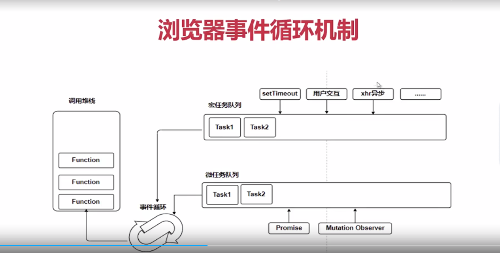

# 事件循环

## 宏任务、微任务、事件循环

### 进程、线程

- 进程：资源分配的最小单位
- 线程：CPU调度的最小单位
- 线程是以依附于进程的，一个进程可以有多个线程
- 浏览器是多进程的
  - 主进程：负责控制浏览器除标签页外的界面，地址栏，状态栏，前进后退等
  - 存储进程
  - 网络进程：负责网络资源的加载
  - 代理进程
  - 渲染进程
  - 插件进程：负责界面渲染，脚本执行，事件处理等等，每个tab一个渲染进程
  - 音频进程

#### 渲染进程中的线程

- JS引擎线程：负责解析和执行js。（与GUI渲染线程互斥）
- GUI渲染线程：解析html和css。构建dom树，cssom树，render树和绘制页面等。（与js引擎线程互斥）
- 事件触发线程：控制事件循环
- 定时器触发线程：setTimeout和setInterval计时的线程。
- 异步http请求线程：ajax的异步请求，fetch请求等。

### 异步操作

- 定义：是指浏览器的两个或两个以上线程共同完成的操作
- 举例：
  - ajax异步请求：异步http请求线程 + js引擎线程
  - setTimeout：定时器触发线程 + js引擎线程

### 宏任务

- 定义：执行一个程序、事件回调或者interval/timeout被触发的标准机制而被调度的任意JS代码

### 微任务

- Promise
- MutationObserver

### 浏览器事件循环机制

- 一次循环执行任务队列一个宏任务
- 然后执行所有微任务

### 同源窗口之间共享事件循环

- 场景：
  - 如果一个窗口打开了另一个窗口，他们可能共享一个事件循环
  - 如果窗口包含<iframe>，可能共享一个事件循环
  - 在多进程浏览器中多了窗口碰巧共享一个事件循环
