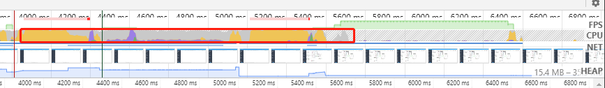

## 首屏优化

- 页面渲染优化：
  - 优化 html 代码：
    - js 链接放底部
    - css 链接放顶部
    - 减少 DOM 层级
  - 优化 js、css 代码
    - 减少重拍重绘操作
    - 降低 css 选择器复杂性
  - 动画效果优化
    - 使用 requestAnimationFrame
    - 通过 translateZ 等来实现硬件加速
- 资源加载优化
  - 减少资源大小
    - 代码压缩
    - webpack 开启 Gzip：插件（Accept-Encoding: gzip, deflate, br）
    - 图片压缩
    - 代码拆分模块
  - 请求次数
    - HTttp 强制缓存
    - Service Worker
    - 本地存储（localStorage 等）
  - 请求速度
    - CDN
    - Http 协商缓存
    - DNS Prefetch：优化下一次的 dns 解析速度
    - Http2
  - 优化资源加载时机
    - 路由懒加载：把对应的页面用 import 的形式引入
    - 预加载（preload）

1. 骨架屏
   - 方案 1：简单的图片替换
     - 核心：
       - <link rel='preload' as='image' href='https://...'>
   - 方案 2：html + css
     - 核心：
       - 通过 animation: loading 2s ease infinite;控制背景移动实现从左到右的进度效果
       - 通过 animation: opacity 2s ease infinite;控制透明度实现渐隐渐现的动画效果
   - 方案 3：自动化生成：利用 js 创建出元素、样式之类的
     - 核心：
       - element.getBoundingClientRect()：用于取到元素相对于可视窗口的位置以及宽高
   - 方案 4：插件：vue-skeleton-webpack-plugin

## 白屏优化

- 产生白屏原因：在渲染，即会加载外部 JS、加载外部 CSS、解析生成 DOM 树、生成样式规则、执行 JS、生成布局树、绘制页面等步骤中，由于卡顿会形成白屏
- 优化：其实跟首屏优化差不多
- 重点：
  - 懒加载图片：
    - 原理：先展示可视区域的部分，再展示滚动后的页面
    - ```js
      // 核心代码
      // 视口的高度；
      const clientH = document.documentElement.clientHeight;
      // 滚动的距离，这里的逻辑判断是为了作兼容性处理；
      const clientT =
        document.documentElement.scrollTop || document.body.scrollTop;
      // 逻辑判断，若是视口高度+滚动距离 > 图片到浏览器顶部的距离就去加载；
      // !imgs[i].src 是避免重复请求，能够把该条件取消试试：能够看到不加该条件的话往回滚动就会重复请求；
      if (clientH + clientT > imgs[i].offsetTop && !imgs[i].src) {
        // 使用data-xx的自定义属性能够经过dom元素的dataset.xx取得；
        imgs[i].src = imgs[i].dataset.src;
      }
      // 监听滚动事件
      window.onscroll = () => lazyLoad(imgs);
      // 滚动监听优化：节流
      window.onscroll = throttle(lazyLoad, 500);
      ```

## 虚拟列表

- 定义：只对可见区域进行渲染，对非可见区域中的数据不渲染或部分渲染，以实现减少消耗
- 思路步骤：

  1. 写一个代表可视区域的 div，固定其高度，通过 overflow 使其允许纵向 Y 轴滚动。
  2. 计算区域中可以显示的数据条数。这个可以用可视区域的高度除以单条数据高度得到。
  3. 监听滚动，当滚动条变化时，计算出被卷起的数据的高度。
  4. 计算区域内数据的起始索引，也就是区域内的第一条数据：这个用卷起的高度除以单条数据高度可以拿到。
  5. 计算区域内数据的结束索引。通过起始索引+可显示的数据的条数可以拿到。
  6. 取起始索引和结束索引中间的数据，渲染到可视区域。
  7. 计算起始索引对应的数据在整个列表中的偏移位置并设置到列表上

  ```js
  //可视区域最多出现的数据条数，值是小数的话往上取整，因为极端情况是第一条和最后一条都只显示一部分
  this.showNum = Math.ceil(this.contentHeight / this.itemHeight);
  this.startIndex = Math.floor(this.scrollTop / this.itemHeight); //可视区域第一条数据的索引
  this.endIndex = this.startIndex + this.showNum; //可视区域最后一条数据的后面那条数据的索引
  this.showList = this.listAll.slice(this.startIndex, this.endIndex); //可视区域显示的数据，即最后要渲染的数据。实际的数据索引是从this.startIndex到this.endIndex-1
  const offsetY = this.scrollTop - (this.scrollTop % this.itemHeight); //在这需要获得一个可以被itemHeight整除的数来作为item的偏移量，这样随机滑动时第一条数据都是完整显示的
  this.top = offsetY;
  //监听滚动事件，实时计算scrollTop
        scroll(){
            this.scrollTop = document.querySelector('.content_box').scrollTop;  //element.scrollTop方法可以获取到卷起的高度
            this.getShowList();
        }
  ```

## 大图片加载优化

- 方案 1：preload 预加载
  - <link ref='preload' href='./img...' as='image'>
- 方案 2：图片拆分，将几个 G 的图拆分成几个 KB 的图
- 方案 3：onload 事件（即完成加载）触发之前，先用图片代替
- 方案 4：转成 base64，因为这样可以不用发请求，以算法的形式还原图片，适用于小图片，否则码会很长很长

## 多图片加载优化

- 方案 1：使用雪碧图
- 方案 2：使用 Gzip，在一个文本文件中找出类似的字符串，并临时替换他们，使整个文件变小
  - 方式：
    - 前端压缩：打包的时候通过 webpack 生成对应的.gz 文件，浏览器请求 js、css 等文件的时候，服务器返回对应 jxx.js.jz、xx.css.gz 文件；
    - 服务端压缩：浏览器请求 js、css 等文件的时候，服务器对 js、css 等文件进行 gzip 压缩后传输给浏览器；
- 方案 3：页面懒加载
- 方案 4：使用 Progressive JPEGs，他先会模糊显示，后来在会变清晰
- 方案 5：改变图片格式，推荐 webp，比常规 jpeg 小 40%

## performance

### 操作


### 性能可视化


#### 区域 1：controls 控制栏


- 录制、停止按钮可实时绘制一段时间当前页面时间轴的性能轨迹，时间为秒，停止后生成一张性能分析图
- 屏幕快照选项，需要勾选才会出现屏幕快照截图（一般是默认勾选）
  
- 内存复选框：指标对应的时间资源状态，这个折线图只有在点击 Main 主线程的时候才会有，选择其他的指标时折线图区域时空白。
  

  

  - JS Heap：表示 JS 占用的内存大小
  - Documents：文档数
  - Nodes：Node 节点数
  - Listeners：监听数
  - GPU Memory：GPU 占用数

- Online：表示网速控制，自定义网速
- CPU：对 CPU 进行减速，测试极端环境下对页面的性能影响

#### 区域 2：网页性能指标图

- 概览：FPS（每秒帧数情况）、CPU（CPU 占用情况）、NET（网络资源情况）、HEAP（JS 占用情况）一共四项指标
  
- FPS：一般 60 帧表示流畅，红色越多越卡顿，绿色越高越流畅
  
- CPU 资源：此面积图指示消耗 CPU 资源的事件类型
  
  蓝色(Loading)：表示网络通信和 HTML 解析时间。
  黄色(Scripting)：表示 JavaScript 执行时间。
  紫色(Rendering)：表示样式计算和布局（重排）时间。
  绿色(Painting)：表示重绘时间。
  灰色(other)：表示其它事件花费的时间。
  白色(Idle)：表示空闲时间。
- NET：每条彩色横杠表示一种资源。横杠越长，检索资源所需的时间越长。 每个横杠的浅色部分表示等待时间（从请求资源到第一个字节下载完成的时间）
  
- HEAP：JavaScrip 执行的时间分布
  

### 区域 3：火焰图


- Network：表示每个服务器资源的加载情况。
- Frames：表示每幅帧的运行情况
- Timings：
  - FP（First Paint） 首屏绘制，页面刚开始渲染的时间。
  - FCP（First Contentful Paint） 首屏内容绘制，首次绘制任何文本，图像，非空白 canvas 或 SVG 的时间点
  - LCP（Largest Contentful Paint ） 最大内容绘制，页面上尺寸最大的元素绘制时间
  - DCL（DOMContentLoaded） 表示 HTML 文档加载完成事件。当初始 HTML 文档完全加载并解析之后触发，无需等待样式、图片、子 frame 结束。作为明显的对比，load 事件是当个页面完全被加载时才触发。
  - L（Onload） 页面所有资源加载完成事件。
- Main：表示主线程，主要负责：Javascript 的计算与执行；CSS 样式计算；Layout 布局计算；将页面元素绘制成位图（paint）；将位图给合成线程。
  - PS： - X 轴代表时间，每个长条代表着 event，长条越长就代表花的时间越多，Y 轴代表调用栈。在栈里，上面的 event 调用了下面的 event - 如果在性能长条中的右上角出现了红色的三角形，说明这个事件存在问题，需要特别留意。双击这个带有红色小三角的的事件。在 Summary 面板会看到详细信息。注意 reveal 这个链接，双击它会让高亮触发这个事件的 event。如果点击了 angular-1.4.7.min.js:1135 这个链接，就会跳转到对应的代码处
    

#### 区域 4：统计汇总

- Summary：表示各指标时间占用统计报表
  
- Bottom-Up：表示事件时长排序列表（倒序）=> 可直接查看花费最多时间的活动
  
- Call tree：表示事件调用顺序列表=>可直接查看导致最多工作的根活动
  
- Event Log：表示事件发生的顺序列表=>记录期间的活动顺序查看活动；
  

### 其他监控性能小工具

- Performance monitor 面板：页面性能的实时监控
  

## Memory

<https://juejin.cn/post/7185128318235541563>
