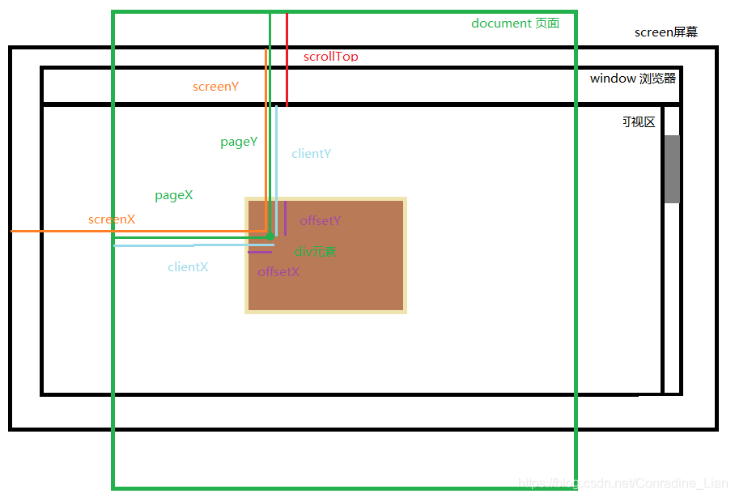
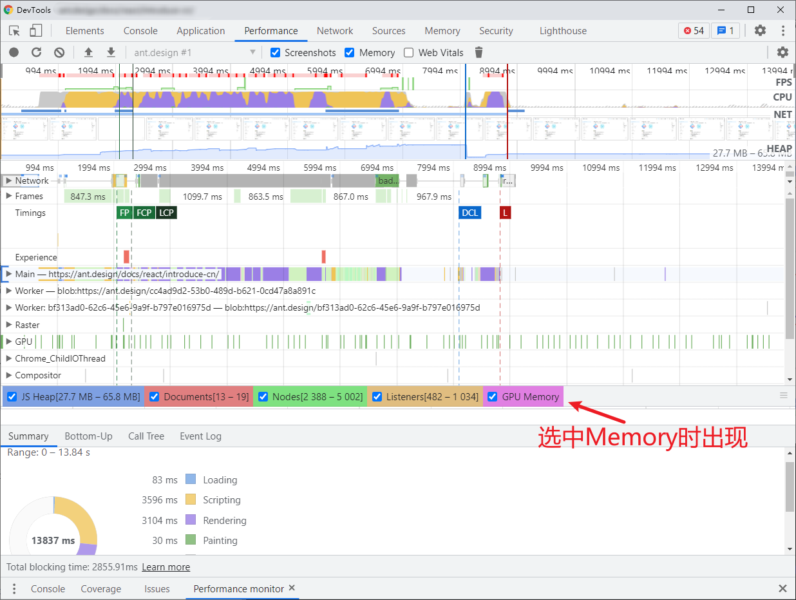
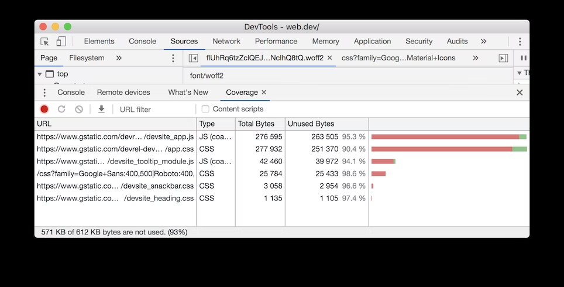
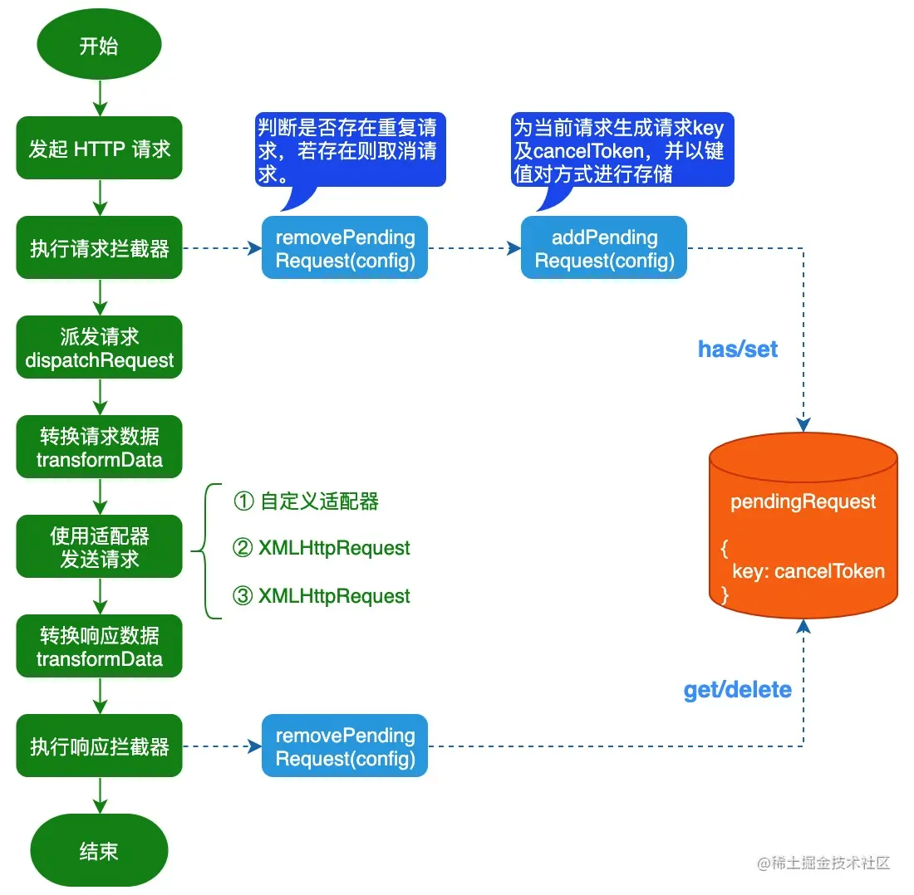
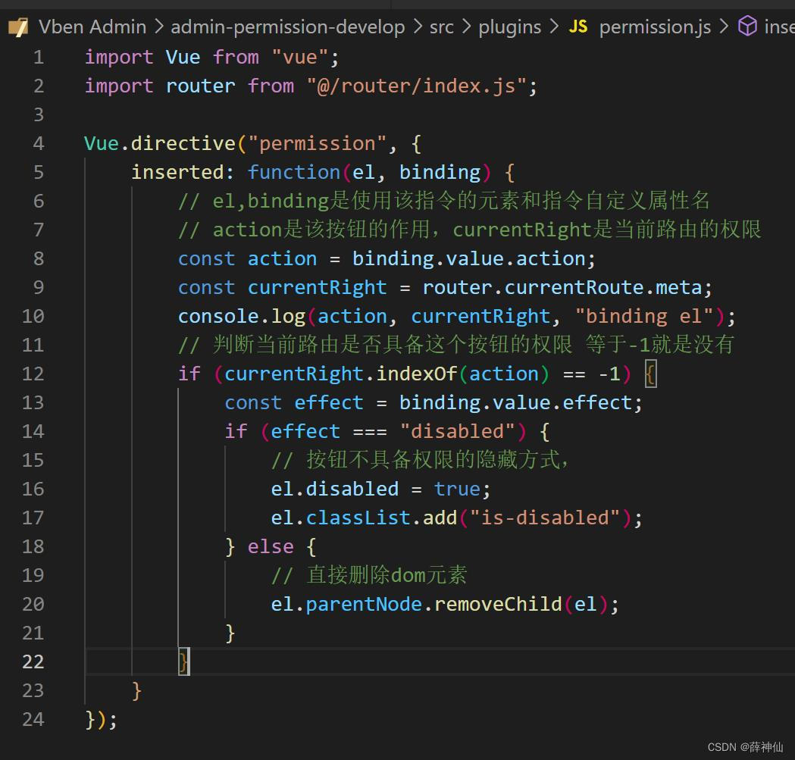

## 首屏优化

- 页面渲染优化：
  - 优化 html 代码：
    - js 链接放底部
    - css 链接放顶部
    - 减少 DOM 层级
  - 优化 js、css 代码
    - 减少重拍重绘操作
      - 涉及到虚拟 DOM：虚拟 DOM 的好处就是不在浏览器页面进行增删改，从而避免了很多的重绘回流操作
    - 降低 css 选择器复杂性
  - 动画效果优化
    - 使用 requestAnimationFrame
      - 思考点：
        - 如何计算动画帧率？（看 1 秒钟内执行了多少次回调函数）
    - 通过 animation\translate\will-change 属性\来实现硬件加速
- 资源加载优化
  - 减少资源大小
    - 代码压缩
    - webpack 开启 Gzip：插件（Accept-Encoding: gzip, deflate, br）
    - 图片压缩
    - 代码拆分模块
  - 请求次数
    - Http 强制缓存：改变 cache-control:max-age=3600(3600s 之后失效)
    - Service Worker
    - 本地存储（localStorage 等）
  - 请求速度
    - CDN 加速：可以将静态资源放入第三方 CDN 服务器上
    - Http 协商缓存
    - DNS Prefetch：优化下一次的 dns 解析速度
    - Http2
  - 优化资源加载时机
    - 路由懒加载：把对应的页面用 import 的形式引入
    - 预加载（preload）
- 注意：表达的时候可以简单说采用了传统的对 js、css、html 的优化，然后再说动画优化以及资源加载优化

1. 骨架屏
   - 方案 1：简单的图片替换
     - 核心：
       - \<link rel='preload' as='image' href='https://...'>
   - 方案 2：html + css
     - 核心：
       - 通过 animation: loading 2s ease infinite;控制背景移动实现从左到右的进度效果
       - 通过 animation: opacity 2s ease infinite;控制透明度实现渐隐渐现的动画效果
   - 方案 3：自动化生成：利用 js 创建出元素、样式之类的
     - 核心：
       - element.getBoundingClientRect()：用于取到元素相对于可视窗口的位置以及宽高
   - 方案 4：插件：vue-skeleton-webpack-plugin

## 白屏优化

- 产生白屏原因：在渲染，即会加载外部 JS、加载外部 CSS、解析生成 DOM 树、生成样式规则、执行 JS、生成布局树、绘制页面等步骤中，由于卡顿会形成白屏
- 优化：其实跟首屏优化差不多
- 重点：

  - 懒加载图片：

    - 方案 1：
      - 原理：先展示可视区域的部分，再展示滚动后的页面
      - 缺点：配合 js 代码，进行一定量的运算，不够简洁
      - ```js
        // 核心代码
        // 视口的高度；
        const clientH = document.documentElement.clientHeight;
        // 滚动的距离，这里的逻辑判断是为了作兼容性处理；
        const clientT =
          document.documentElement.scrollTop || document.body.scrollTop;
        // 逻辑判断，若是视口高度+滚动距离 > 图片到浏览器顶部的距离就去加载；
        // !imgs[i].src 是避免重复请求，能够把该条件取消试试：能够看到不加该条件的话往回滚动就会重复请求；
        if (clientH + clientT > imgs[i].offsetTop && !imgs[i].src) {
          // 使用data-xx的自定义属性能够经过dom元素的dataset.xx取得；
          imgs[i].src = imgs[i].dataset.src;
        }
        // 监听滚动事件
        window.onscroll = () => lazyLoad(imgs);
        // 滚动监听优化：节流
        window.onscroll = throttle(lazyLoad, 500);
        ```
    - 方案 2：

      - 原理：使用 IntersectionObserver 这个类，检查是否在可视区域，再展示
      - 缺点：不够简洁

        ```js
        document.addEventListener('DOMContentLoaded', function () {
          var lazyImages = [].slice.call(document.querySelectorAll('img.lazy'));
          if ('IntersectionObserver' in window) {
            let lazyImageObserver = new IntersectionObserver(function (
              entries,
              observer
            ) {
              entries.forEach(function (entry) {
                // 关键：判断是否已经进入可视区域
                if (entry.isIntersecting) {
                  let lazyImage = entry.target;
                  lazyImage.src = lazyImage.dataset.src;
                  lazyImage.srcset = lazyImage.dataset.srcset;
                  lazyImage.classList.remove('lazy');
                  lazyImageObserver.unobserve(lazyImage);
                }
              });
            });

            lazyImages.forEach(function (lazyImage) {
              lazyImageObserver.observe(lazyImage);
            });
          } else {
            // Possibly fall back to event handlers here
          }
        });
        ```

    - 方案 3：
      - 原理：利用 HTML 的 loading 属性，实现延迟加载，即位于可视区域就加载图片
      - 实现：
      - \
      - 注意：还有一个属性 decoding，值类型有三个：
        - sync：同步解码图像，保证与其他内容一起显示
        - async：异步解码图像，其他内容优先显示
        - default：默认值，默认不设置

## 虚拟列表

- 定义：只对可见区域进行渲染，对非可见区域中的数据不渲染或部分渲染，以实现减少消耗
- 思路步骤：

  1. 写一个代表可视区域的 div，固定其高度，通过 overflow 使其允许纵向 Y 轴滚动。
  2. 计算区域中可以显示的数据条数。这个可以用可视区域的高度除以单条数据高度得到。
  3. 监听滚动，当滚动条变化时，计算出被卷起的数据的高度。
  4. 计算区域内数据的起始索引，也就是区域内的第一条数据：这个用卷起的高度除以单条数据高度可以拿到。
  5. 计算区域内数据的结束索引。通过起始索引+可显示的数据的条数可以拿到。
  6. 取起始索引和结束索引中间的数据，渲染到可视区域。
  7. 计算起始索引对应的数据在整个列表中的偏移位置并设置到列表上

  ```js
  //可视区域最多出现的数据条数，值是小数的话往上取整，因为极端情况是第一条和最后一条都只显示一部分
  this.showNum = Math.ceil(this.contentHeight / this.itemHeight);
  this.startIndex = Math.floor(this.scrollTop / this.itemHeight); //可视区域第一条数据的索引
  this.endIndex = this.startIndex + this.showNum; //可视区域最后一条数据的后面那条数据的索引
  this.showList = this.listAll.slice(this.startIndex, this.endIndex); //可视区域显示的数据，即最后要渲染的数据。实际的数据索引是从this.startIndex到this.endIndex-1
  const offsetY = this.scrollTop - (this.scrollTop % this.itemHeight); //在这需要获得一个可以被itemHeight整除的数来作为item的偏移量，这样随机滑动时第一条数据都是完整显示的
  this.top = offsetY;
  //监听滚动事件，实时计算scrollTop
        scroll(){
            this.scrollTop = document.querySelector('.content_box').scrollTop;  //element.scrollTop方法可以获取到卷起的高度
            this.getShowList();
        }
  ```

  - 缺点：没有渲染上去的节点，web 页面是（ctrl+F）搜索不到这个关键字的

- 方案 2：使用 content-visibility: auto，可以实现不把节点加到 DOM 上去
  

## 大图片加载优化

- 方案 1：preload 预加载
  - \<link ref='preload' href='./img...' as='image'>
- 方案 2：图片拆分，将几个 G 的图拆分成几个 KB 的图
- 方案 3：onload 事件（即完成加载）触发之前，先用图片代替

## 多图片加载优化

- 方案 1：使用雪碧图（由于过去网络较慢，所以用，现在不用了基本）
- 方案 2：使用 Gzip，在一个文本文件中找出类似的字符串，并临时替换他们，使整个文件变小
  - 方式：
    - 前端压缩：打包的时候通过 webpack 生成对应的.gz 文件，浏览器请求 js、css 等文件的时候，服务器返回对应 jxx.js.jz、xx.css.gz 文件；
    - 服务端压缩：浏览器请求 js、css 等文件的时候，服务器对 js、css 等文件进行 gzip 压缩后传输给浏览器；
- 方案 3：页面懒加载
- 方案 4：使用 Progressive JPEG，他先会模糊显示，后来在会变清晰
  - 原理：图片会被多次扫描，随着扫描次数的增多，图片会越来越清晰
  - 使用场景：当图片>10K 时，使用渐进式 JPEG，压缩率可达 94%，比普通体积更小；<10K 时，用普通 JPEG 会更好
  - 缺点：吃内存和 CPU
- 方案 5：改变图片格式，推荐 webp，比常规 jpeg 小 40%，另外还有 avif，jxl，解码性能比较：avif<jpeg xl<webp
  - 原理：更优的图像数据压缩算法，有更好的有损（支持透明通道）、无损两种压缩模式，在转化 png 和 jpeg 上效果优越
  - 缺点：解码性能差
- 方案 6：考虑到兼容性，设计了以下方案
  ```html
  <picture>
    <!-- 兼容性调整的同时，展示性能更好的图片 -->
    <source src="image.avif" type="image/avif" />
    <source src="image.jxl" type="image/jxl" />
    <source src="image.webp" type="image/webp" />
    <!-- 最终兜底方案 -->
    
  </picture>
  ```

## performance

### 操作


### 性能可视化


#### 区域 1：controls 控制栏


- 录制、停止按钮可实时绘制一段时间当前页面时间轴的性能轨迹，时间为秒，停止后生成一张性能分析图
- 屏幕快照选项，需要勾选才会出现屏幕快照截图（一般是默认勾选）
  
- 内存复选框：指标对应的时间资源状态，这个折线图只有在点击 Main 主线程的时候才会有，选择其他的指标时折线图区域时空白。
  

  

  - JS Heap：表示 JS 占用的内存大小
  - Documents：文档数
  - Nodes：Node 节点数
  - Listeners：监听数
  - GPU Memory：GPU 占用数

- Online：表示网速控制，自定义网速
- CPU：对 CPU 进行减速，测试极端环境下对页面的性能影响

#### 区域 2：网页性能指标图

- 概览：FPS（每秒帧数情况）、CPU（CPU 占用情况）、NET（网络资源情况）、HEAP（JS 占用情况）一共四项指标
  
- FPS：一般 60 帧表示流畅，红色越多越卡顿，绿色越高越流畅
  
- CPU 资源：此面积图指示消耗 CPU 资源的事件类型
  
  蓝色(Loading)：表示网络通信和 HTML 解析时间。
  黄色(Scripting)：表示 JavaScript 执行时间。
  紫色(Rendering)：表示样式计算和布局（重排）时间。
  绿色(Painting)：表示重绘时间。
  灰色(other)：表示其它事件花费的时间。
  白色(Idle)：表示空闲时间。
- NET：每条彩色横杠表示一种资源。横杠越长，检索资源所需的时间越长。 每个横杠的浅色部分表示等待时间（从请求资源到第一个字节下载完成的时间）
  
- HEAP：JavaScrip 执行的时间分布
  

### 区域 3：火焰图


- Network：表示每个服务器资源的加载情况。
- Frames：表示每幅帧的运行情况
- Timings：
  - FP（First Paint） 首屏绘制，页面刚开始渲染的时间。
  - FCP（First Contentful Paint） 首屏内容绘制，首次绘制任何文本，图像，非空白 canvas 或 SVG 的时间点
  - LCP（Largest Contentful Paint ） 最大内容绘制，页面上尺寸最大的元素绘制时间
  - DCL（DOMContentLoaded） 表示 HTML 文档加载完成事件。当初始 HTML 文档完全加载并解析之后触发，无需等待样式、图片、子 frame 结束。作为明显的对比，load 事件是当个页面完全被加载时才触发。
  - L（Onload） 页面所有资源加载完成事件。
- Main：表示主线程，主要负责：Javascript 的计算与执行；CSS 样式计算；Layout 布局计算；将页面元素绘制成位图（paint）；将位图给合成线程。
  - PS：
    - X 轴代表时间，每个长条代表着 event，长条越长就代表花的时间越多，Y 轴代表调用栈。在栈里，上面的 event 调用了下面的 event
    - 如果在性能长条中的右上角出现了红色的三角形，说明这个事件存在问题，需要特别留意。双击这个带有红色小三角的的事件。在 Summary 面板会看到详细信息。注意 reveal 这个链接，双击它会让高亮触发这个事件的 event。如果点击了 angular-1.4.7.min.js:1135 这个链接，就会跳转到对应的代码处
      

#### 区域 4：统计汇总

- Summary：表示各指标时间占用统计报表
  
- Bottom-Up：表示事件时长排序列表（倒序）=> 可直接查看花费最多时间的活动
  
- Call tree：表示事件调用顺序列表=>可直接查看导致最多工作的根活动
  
- Event Log：表示事件发生的顺序列表=>记录期间的活动顺序查看活动；
  

### 其他监控性能小工具

- Performance monitor 面板：页面性能的实时监控
  

## lighthouse

使用 lighthouse 的结果，一般会给出几点优化建议，

### FCP（First Contentful Paint）：

- 定义：浏览器记录首次绘制来自 DOM 的内容的时间，内容必须是文本、图片（包含背景图），非白色的 canvas 或 SVG，也包括带有正在加载中的字体的文本
- 衡量：小于 2 秒就是绿色，小于 4 秒是橙色，大于 4 秒就是红慢
- 测量工具：PerformanceObserver 类和 web-vitals 库
- 优化：

  - 消除渲染阻塞资源：
    - script 标签没加 defer 和 async 属性
    - link 标签没加 disabled 属性
  - 推迟使用非关键的代码（用 coverage 标签卡来识别关键和非关键代码，绿色是关键，红色是非关键）
    

    - 对脚本添加 async 或者 defer 属性
    - 对 link 样式表：
      ```html
      <!--
        link 的 onload 属性允许在加载 CSS 完成后对其进行处理。
        在使用 onload 处理程序后将其“归零”有助于某些浏览器避免在切换 rel 属性时重新调用处理程序。
      -->
      <link
        rel="preload"
        href="styles.css"
        as="style"
        onload="this.onload=null;this.rel='stylesheet'"
      />
      <!-- 对不禁止javascript的浏览器进行兼容 -->
      <noscript><link rel="stylesheet" href="styles.css" /></noscript>
      ```

  - 缩小 css 的文件体积：webpack 配置
  - 预加载关键请求：

  ```html
  <head>
    ...
    <link rel="preload" href="styles.css" as="style" />
    <link rel="preload" href="ui.js" as="script" />
    ...
  </head>
  ```

  - 减少网络负载：
  - 使用图片格式 webp，能有效吧图片提价减小四分之一
    使用压缩插件，将代码体积缩小，如 Gzip，http2，webpack 插件
  - 使用缓存：cache-control 和 expries 设置的长一点，或者设置 no-cache：直接用协商缓存，对于需要跟服务器保持同步的数据

### LCP（last contentful paint）

- 定义:可视区域中最大的内容元素呈现在屏幕上的时间，用于估算页面的主要内容对用户可见时间
- 监视的区域：图片，svg，video，背景图
- 优化手段：与 fcp 差不多

### FID（First Input Delay）

- 定义：首次输入延迟，从用户第一次与页面交互到浏览器实际能够响应用户交互的时间点
- 原因：输入延迟的主要原因是，浏览的主线程正在忙于做其他事情（加载、解析应用程序），不能响应用户输入；会影响第一印象，主要发生在页面加载期间。
- 监视的区域：input，select，textarea，a 链接，按键
- 检测工具：Performance 和 web-vitals 库
- 优化：
  - 将事件处理程序放到 requestAnimationFrame（RAF）中
  - 对于 js，采用压缩体积，删除未使用代码，拆分代码，按需引入的方法等
  - 减少 js 主线程运行损耗，如：防抖，webworker（多图片）

### TTI（Time To Interactive）：

- 定义：网页第一次达到可交互状态的时间点；时长为 5 秒的安静窗口之前的最后一个长任务的结束时间（没找到长任务 long task ，则与 FCP 值相同）
  - 安静窗口：没有长任务且不超过两个正在处理的网络 GET 请求
- 优化原理：FCP 和 TTI 之间的差值降至最低
- 优化方式：与上述差不多

### TBT（Total Block Time）：

- 定义：总阻塞时间，相当于 fcp 和 tti 之间发生的每个长任务阻塞时间之和
- 优化方式：与上述差不多

### CLS（Cumulative Layout Shift）：

- 定义：测量在页面整个生命周期中发生的每个意外布局的次数来综合评分
- 优化：
  - 除非是对用户交互做出响应，否则避免在现有内容的上方插入内容
  - 对动画使用：will-change，transform，opacity

### Speed Index:

- 定义：是一个表示页面可视区域中内容的填充速度的指标，通过计算页面可见区域内容显示的平均时间来衡量

### 总结

(1). 延迟加载首屏视窗外的图片: 改审核项的优化原理在有关图像优化章节有过详细介绍，对首屏关键资源加载完毕之后，延迟首屏外或处于隐藏状态的图片加载能够有效的缩短用户可交互前的等待时间，提升用户访问体验
(2). 压缩 css 文件: 可以降低网络负载规模
(3). 压缩 js 文件: 可以降低网络负载规模
(4). 对图片采用高效的编码方式： 经过编码优化的图片文件，不但其加载速度会更快，而且需要传输的数据规模也会很小
(5). 采用新一代的图片文件格式: WebP、JPEG XR、JPEG 2000 等较新的图片文件格式通常比传统的 PNG 或 JPEG 有更好的压缩效果，能够获得更快的下载速度和更少的流量消耗，但使用的同时还需要注意对新格式图片的兼容性处理
(6). 开启文本压缩: 对于文本资源，先压缩在提供能够最大限度地减少网络传输的总字节数，常用的压缩方式有 gzip,deflate 和 brotli,至少采用其中一种即可
(7). 避免多次页面重定向： 过多的重定向会在网页加载前造成延迟
(8). 预加载关键请求: 通过<link rel="preload">来预先获取网页加载后期需要请求的资源，这主要是为了充分利用网站运行的间歇期
(9). 使用视频格式提供动画内容: 建议通过 WebP 或 MPEG4 提供动画，来取代网页中大型 GIF 动画
(10). 避免 DOM 规模过大: 如果规模过大，则可能会导致消耗大量的内存空间，过长的样式极端耗时及较高的页面布局重排代价。Lighthouse 给出的参考建议是，页面包含的 DOM 元素最好少雨 1500 个，树的深度尽量控制不要超过 32 层
(11). 确保网页字体加载期间文本内容可见: 使用 CSS 的 font-display 功能,来让网站页面的文本字体在加载期间始终可见

### http2

### 移除无用的 css 和 js 代码

- 开启 Gzip 压缩（需要 nginx）
- 打包出来 chunk.js 有点大，就需要对 webpack 进行配置：切割一下打包文件，不要全部打包到一起，如：全局引入了 echarts 和 element 我们把这两个 js 分开打包
- 按需引入第三方库，如 element-ui，需要按需引入 button；要是组件过多，需要全局引入，就尽量使用 cdn
- 对静态资源使用强制缓存，协商缓存，需要配合 nginx

### 减少 js 运行时间

当 js 代码超过 2 秒时，将发出警告

- 拆分 js 代码
- 压缩代码
- tree shaking

### 消除阻止渲染的资源

阻塞渲染会导致 FCP 和 LCP 的延迟

- FCP 的测量
  ```js
  // PerformanceObserver监听名称为first-contentful-paint的油漆条目，并将其记录到控制台
  new PerformanceObserver((entryList) => {
    for (const entry of entryList.getEntriesByName('first-contentful-paint')) {
      console.log('FCP candidate:', entry.startTime, entry);
    }
  }).observe({ type: 'paint', buffered: true });
  ```

### 网络资源

- preload：让资源提前加载，并在需要执行时再执行；适用于当前页面优先级更高的请求
- prefetch：让下一个页面的资源提前请求；适用于下一个页面的请求
- 请求缓存

## Memory

<https://juejin.cn/post/7185128318235541563>

[内存排查](https://jinlong.github.io/2016/05/01/4-Types-of-Memory-Leaks-in-JavaScript-and-How-to-Get-Rid-Of-Them/)

## Axios 取消重复请求

1. 取消请求方式

- Axios 内部提供的 CancelToken，适用于适合在某一时间同时取消所有请求：

  ```js
  const CancelToken = axios.CancelToken;
  const source = CancelToken.source();
  axios.post(
    '/user/12345',
    {
      name: 'semlinker',
    },
    {
      cancelToken: source.token,
    }
  );

  source.cancel('Operation canceled by the user.'); // 取消请求，参数是可选的
  ```

- 调用 CancelToken 的构造函数来创建 CancelToken，适用于每个请求分情况是否进行单独取消：

  ```js
  const CancelToken = axios.CancelToken;
  let cancel;
  axios.get('/user/12345', {
    cancelToken: new CancelToken(function executor(c) {
      cancel = c;
    }),
  });

  cancel(); // 取消请求
  ```

2. 根据请求方法、请求 IP 地址、参数（用 sort 调整顺序）来生成唯一的 token（拼接字符串）
3. 实现三个方法：

- 方法 1：将生成的请求 token 放入 map 对象
- 方法 2：将取消的方法与请求 token 映射起来放入 map
- 方法 3：检查请求是否重复，若重复，则取消已发请求

4. 设置请求拦截器：先用方法 3，取消之前的请求，再用方法 2，添加请求 token 进 mao
5. 设置响应拦截器：返回响应或者报错，使用方法 3 取消请求



- [文章出处](https://juejin.cn/post/6955610207036801031#heading-3)

## 权限模块设计

1. 后端返回管理员身份角色
2. 前端根据角色对路由表进行增删改，将信息写在 route 的 meta 中
3. 部分路由上的按钮、视图需要根据角色进行修改，需要用到自定义指令 vue.directive
4. 通过 router.currentRouter 来进行获取 meta 信息
5. 根据 meta 信息，对自定义指令进行配置
   

## 大文件上传

原因：上传 excel 文件，图片过大，由于使用了传统的页导致请求时间过长，页面卡顿
实现：

1. 文件切片
   实现： 设置开始索引，结束索引，片段长度，通过 file.slice 将一个文件二进制切成几份，然后挨个上传

   ```js
   function slice(file, piece = 1024 * 1024 * 5) {
     let totalSize = file.size; // 文件总大小
     let start = 0; // 每次上传的开始字节
     let end = start + piece; // 每次上传的结尾字节
     let chunks = [];
     while (start < totalSize) {
       // 根据长度截取每次需要上传的数据
       // File对象继承自Blob对象，因此包含slice方法
       let blob = file.slice(start, end);
       chunks.push(blob);

       start = end;
       end = start + piece;
     }
     return chunks;
   }
   let file = document.querySelector('[name=file]').files[0];
   const LENGTH = 1024 _ 1024 _ 0.1;
   let chunks = slice(file, LENGTH); // 首先拆分切片
    chunks.forEach(chunk=>{
    let fd = new FormData();
    fd.append("file", chunk);
    post('/mkblk.php', fd)
    })
   ```

2. 还原文件
   背景：避免提交相同的文件，以及保证能够还原文件
   实现：context 字段可以作为一个文件的唯一标识，可以根据用户信息，文件名，文件长度来生成 context 值；chunk 字段可以作为切片的顺序，保证拼接顺序

   ```js
   // 获取context，同一个文件会返回相同的值
   function createContext(file) {
     return file.name + file.length;
   }
   ...
   let tasks = [];
   chunks.forEach((chunk, index) => {
     let fd = new FormData();
     fd.append('file', chunk);
     // 传递context
     fd.append('context', context);
     // 传递切片索引值
     fd.append('chunk', index + 1);

     tasks.push(post('/mkblk.php', fd));
   });
   // 所有切片上传完毕后，调用mkfile接口，通知服务端拼接
   Promise.all(tasks).then(res => {
   let fd = new FormData();
   fd.append("context", context);
   fd.append("chunks", chunks.length);
   post("/mkfile.php", fd).then(res => {
    console.log(res);
    });
   });

   ```

3. 断点续传
   背景：上传过程中会因为用户关闭浏览器或者网络出现问题造成只上传了一部分
   实现：
   1. 客户端本地通过 localStorage 实现，记录上传了哪些切片，保存到本地，下次传输相同文件时，只选择未上传的切片进行上传
   2. 服务端提供接口查询哪些切片已经上传，前端也是只选择未上传的切片进行上传
4. 上传进度与暂停
   实现：
   进度：axios 中有 onUploadProgress（progess）；XMLHttpRequest.upload
   暂停：axios.CancelToken.source.cancel()；

后续优化：

1. 对于切片数量很多，我们可以设置最大多少个切片，从而减少请求数量

来源：[链接](https://www.yuque.com/u1598738/trf64p/tx93taqxlzs1ng8e?singleDoc#)

## 时间切片

背景：在搜索人员存在大量数据的时候会出现，页面卡顿；对于多图片的渲染，考虑到存在图片宽高、页面几行几列布局的大量计算，造成页面卡顿；
本质：就是这些大量的计算导致的长任务，阻塞了 js 主线程
实现：

1. 用 performance 排查有关的长任务
2. 将长任务放到一个数组中
3. 设置执行时间，使用 do while 循环，对数组中的任务进行一个个执行，当执行时间小于默认值时，不再执行
4. 用 setTimout 来执行下一次的任务，直至数组清空；
5. 也可以使用 message Chanel 来实现，setTimeout 间隔是 4ms，message Chanel 要更小

注意点：

1. 如果遇到一个任务过长，那就还需要对其进行拆分
2. 和 requestIdleCallback 区别，一个是空闲时间执行，一个是在规定时间限制下执行

```js
const schduler = (tasks) => {
  const DEFAULT_RUNTIME = 16;
  const { port1, port2 } = new MessageChannel();
  let sum = 0;

  // 运行器
  const runner = () => {
    const prevTime = performance.now();
    do {
      if (tasks.length === 0) {
        return;
      }
      const task = tasks.shift();
      const value = task();
      sum += value;
    } while (performance.now() - prevTime < DEFAULT_RUNTIME);
    // 当前分片执行完成后开启下一个分片
    port2.postMessage('');
  };

  port1.onmessage = function () {
    runner();
  };

  port2.postMessage('');
};
```

来源：[链接](https://zhuanlan.zhihu.com/p/436152473)
